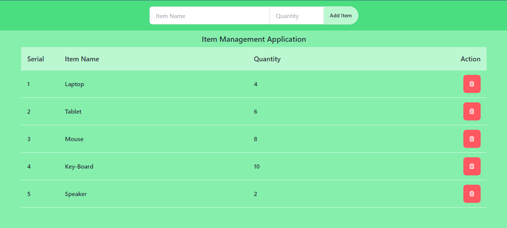

<h1 align="center">Item Management Application Using Local Storage</h1>
<p align="center">This project is a simple Item Management Application built with JavaScript that allows users to add items with their corresponding quantities and dynamically manage them through a user-friendly interface. The application integrates localStorage to persist data across sessions, ensuring that users' inputs are not lost even if the page is refreshed.</p>


## Project Live Link: 
<a align="center" href="https://item-management-application.netlify.app/">Click Here and Visite This Project</a>


## Project Layout:


## Key Features:

1 **Adding Items with Quantity:**
- **Users can input an item name and a corresponding quantity using form fields.
- **Once the form is submitted, the application dynamically adds the item to the list displayed on the page.
- **Each item is displayed with a unique serial number that auto-increments with each new entry.

2 **Data Persistence with Local Storage:**
- **The application uses the browser’s localStorage to save the item and its quantity, so the data remains available even after the user closes or refreshes the page.
- **Upon loading the page, the stored data is automatically fetched and displayed, maintaining the items the user previously entered.

**Delete Functionality:**
- **Each displayed item has a delete button (trash can icon). When clicked, this button removes the item from both the DOM and localStorage.
- **This ensures that the list stays up-to-date, and the user can manage their items easily by removing any unnecessary ones.

**Responsive UI:**
- **The project uses Tailwind CSS classes to provide a clean and responsive user interface.
- **The UI is designed to be intuitive, with a simple layout that displays the serial number, item name, quantity, and a delete button.


## Technologies Used:

- **JavaScript: Core logic for adding, deleting, and storing items.
- **HTML: Markup for the structure of the application.
- **Tailwind CSS: For styling the application with a modern, mobile-friendly design.
- **FontAwesome Icons: For the delete (trash can) icon.
- **LocalStorage: To persist the item data across sessions.

## How It Works:
- **Adding an Item: The user enters the item name and quantity, then clicks the button to add the item to the list. The serial number is generated automatically and incremented with each new item.
- **Displaying Items: The items are displayed dynamically on the page, with their serial number, name, quantity, and a delete button for each entry.
- **Deleting an Item: When the delete button is clicked, the corresponding item is removed both from the page and from localStorage, ensuring the data stays consistent.


<h1 align="center">ALL Html Code Bellow</h1>


## Html Heder Content Code:
```html
<section class="bg-green-400 py-4">
    <div class="container w-11/12 mx-auto ">
        <div class=" bg-green-400 ">
            
            <div class=" join flex justify-center ">
                <input id="item-name" type="text" placeholder="Item Name" class="input join-item input-bordered w-full max-w-xs" />
                <input id="item-quantity" type="number" placeholder="Quantity" class="input join-item input-bordered w-36 max-w-xs" />
                <button onclick="additem()" class="btn join-item bg-green-200  rounded-r-full ">Add Item</button>
            </div>
        </div>
    </div>
</section>
```

## Html Main Content Code:

```html
<section class="bg-green-300 pb-4">
    <div class="container w-11/12 mx-auto h-screen">
        <h2 class="text-center py-2 text-xl font-semibold  border-b border-green-200">Item Management Application</h2>
        <div class="  bg-green-300 ">
            <div class="flex justify-around items-center border-b bg-green-200 border-green-100 py-4 px-4">
                <p class="text-lg font-semibold w-1/12">Serial</p>
                <p class="text-lg font-semibold w-5/12">Item Name</p>
                <p class="text-lg font-semibold w-4/12">Quantity</p>
                <p class="text-lg font-semibold w-2/12 text-right">Action</p>
            </div>

            <div id="items-container" class="">
                
            </div>
        </div>
    </div>
</section>

```

<h1 align="center">ALL JavaScript Code Bellow</h1>

## Add item
```js
let serial = 1;
const additem = () => {
    // Get input Fields
    const itemField = document.getElementById('item-name')
    const quantityField = document.getElementById('item-quantity')

    // get input value
    const items = itemField.value;
    const quantity = parseInt(quantityField.value)

    // Clear Form 
    itemField.value = "";
    quantityField.value = "";

    displayItems(items , quantity)
    saveItemsInLocalStorage(items, quantity)
}
```

## Display input items:
```js
const displayItems = (items, quantity) => {
    
    const itemContainer = document.getElementById('items-container')
    
    const div = document.createElement('div')
    div.innerHTML = `
        <div class="flex justify-between items-center py-3 border-b border-green-100 hover:bg-green-200 px-4">
                <p class="text-lg font-semibold w-1/12">${serial}</p>
                <p class="text-lg font-semibold w-5/12">${items}</p>
                <p class="text-lg font-semibold w-4/12">${quantity}</p>
                <p class="text-lg font-semibold w-2/12 text-right"><button class="btn btn-error delete-btn"><i class="fa-regular fa-trash-can text-white"></i></button></p>
        </div>

    `
    // Add delete functionality
    const deleteButton = div.querySelector('.delete-btn');
    deleteButton.addEventListener('click', () => {
        deleteItem(items, div);
    });

    // 
    itemContainer.appendChild(div)
    serial++;
}

```

### Delete Item from DOM and Local Storage: 

```js
const deleteItem = (itemName, itemElement) => {
    // Remove item from the DOM
    itemElement.remove();
    
    // Remove item from Local Storage
    const items = getStoreItems();
    delete items[itemName];
    localStorage.setItem('items', JSON.stringify(items));
}
```

### Local Storage:

```js
const getStoreItems = () => {
    let items = {};
    const itemsCart = localStorage.getItem('items')
    if(itemsCart){
        items = JSON.parse(itemsCart);
    }
    return items;
}
```

## Save items in LocalStorage:

```js
const saveItemsInLocalStorage = (items, quantity) => {
    const item = getStoreItems();
    item[items] = quantity;
    const stringifyed = JSON.stringify(item);
    localStorage.setItem('items', stringifyed)
}
```


## Display Data from Local storage:

```js
const localStorageDataDisplay = () => {
    const saveItems = getStoreItems();
    for (const item in saveItems){
        const quantity = saveItems[item];
        displayItems(item, quantity)
    }

}
localStorageDataDisplay()

```